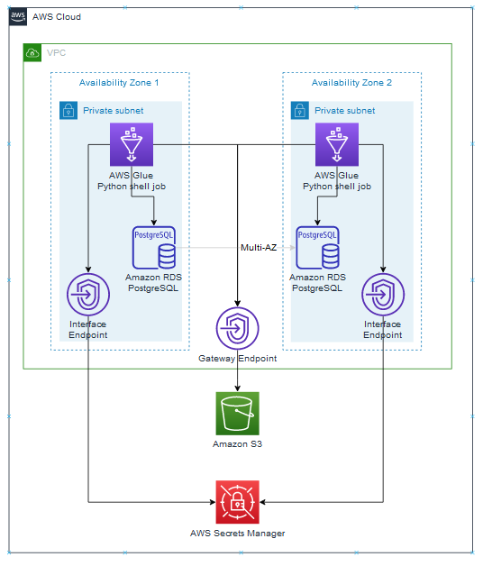

# Archive and Purge Data for Amazon RDS for PostgreSQL with PostgreSQL Compatibility using pg_partman and Amazon S3 and AWS Glue automation

This repo demonstrates an automated solution for archiving and restoring partitioned tables in PostgreSQL. It provides the CDK to automatically create the infrastructure on the AWS Cloud, 
together with the Archive and Restore glue jobs. The repo provides automation to the solution outlined in the "Archive and Purge Data for Amazon RDS for PostgreSQL and Amazon Aurora with PostgreSQL Compatibility 
using pg_partman and Amazon S3" AWS Database Blog, by Li Liu, Samujjwal Roy, and Shunan Xiang

   https://aws.amazon.com/blogs/database/archive-and-purge-data-for-amazon-rds-for-postgresql-and-amazon-aurora-with-postgresql-compatibility-using-pg_partman-and-amazon-s3/

The CDK creates the cloud infrastructure, including the VPC, S3 bucket, PostgreSQL database, Glue Jobs and Glue Workflow into your AWS Account. 

Like the original blog, the solution depends on a sample data set that demonstrates a table of customer ticket purchases partitioned by month using the partman extension. This README includes the steps to
set up the test data that the automated solution depends on. 

Two automated Glue Workflows are provided in this distribution:
- Maintain and Archive Workflow - runs partman.run_maintenance to create new partitions and mark old partitions as cold. The second job in the workflow automatically archives any cold partion tables to S3
using the AWS-S3 extension, and then drops the cold partition tables.
- Restore Workflow - taking a month as a parameter, re-creates the partition table by using partman, and then uses AWS-S3 to restore the data from the S3 archive.

## Archiecture Diagram
	

The PostgreSQL RDS database runs in a private subnet. It stores its credentials in Secrets Managers and uses an S3 Endpoint to archive and restore files to S3 over the AWS Backbone.

The AWS Glue ETL Jobs run in a private subnet. They use the S3 Endpoint to retrive python scripts, and Nat Gateway to download python modules. The Glue Jobs read the database credentials from 
Secrets Manager. They establish a JDBC connection to PostgreSQL to execute SQL statements.

Cloud9 desktop is created in the private subnet allowing the user access to set up test data in PostgreSQL 

## Amazon Cloud Development Kit (CDK)

This repo includes CDK scripts written in Python that automatically provision the infrastructure environment on the AWS Cloud. 

The CDK is organized as 3 stacks, to allow the resources in each stack to complete deployment before commencing deployment of the next stack. The solution provides an example of pass 
parameters by creating attributes that the next stack can read (see app.py module).

The stacks create the following - 
- VPC network enviroment necessary for running an AWS Glue ETL in a private subnet. This includes S3 Endpoint to reach the S3 bucket and a NAT Gateway to download modules from the Internet. 
- PostgreSQL database with permissions to import and export from S3 using the AWS_S3 extension
- AWS Glue ETL jobs, Connection and Workflow, Security Group, parameters and the IAM permissions needed to create and run the jobs.

The user is free to use these samples to extend their own solution and database, using the samples to configure their VPC and create Glue Jobs and Workflow. 
 

## Deploy the application

### Prerequisite
- AWS Account

### In a windows command prompt or linux shell, run the following commands
```
npm install -g aws-cdk

cdk bootstrap aws://<account number>/<region>
```		
(Obtain your account number and choose a region from the AWS Console)

### Clone this repo to a new folder
```
git clone https://github.com/aws-samples/glue-partman-archive-restore.git

cd glue-partman-archive-restore
```
### Create a virtual environment and install the project dependencies (adjust path for mac and linux)
```
python -m venv venv
.\venv\Scripts\activate
pip install -r requirements.txt -t.
```
### Deploy the CDK stacks to your AWS account

- Authenticate to your AWS account
```
cdk deploy * --require-approval=never
```
This will deploy 3 stacks in succession:
vpcstack - creates
- S3 bucket - to store the glue python scripts and the database archives
- VPC with a S3 endpoint Gateway to allow Glue and Postgres to commuicate with S3 
- Private subnets for the RDS Postgres Database, Glue Jobs and Cloud9
- Public subnets for the NAT Gateway to allow glue jobs to download python modules from the Internet
- NAT gateway - to allow the Python in the Glue jobs to download modules from the Internet
			
dbstack 
- RDS Postgres database
- Secrets Manager - PostgreSQL username and password in a secret
- Bucket policies - IAM policy and roles to allow import and export from Postgres to S3

gluestack
- Connector - to connect to the Postgres database
- Glue jobs - running python scripts
- Workflow - triggers and jobs to Maintain, Archive and Restore the partition tables
		
These stacks can be deployed and destroyed progressively (should the AWS authentication be too short for deploying all 3 stacks)	
```	
cdk deploy vpcstack --require-approval=never
cdk deploy dbstack --require-approval=never
cdk deploy gluestack --require-approval=never	
```			

## Populate and configure the test data

###	Obtain a Cloud9 Terminal 
	
- Login to your AWS Account and access the AWS Console
		
- Search for Cloud9 and select AWS Cloud9 
		
- In the AWS Cloud9 page, click "Create environment"
		
- Provide any name - e.g., mytest, 
- In the Network Settings panel, expand VPC settings, change the defaults as follows:
- Amazon Virtual Private Cloud (VPC) - select vpcstack/NewGlueVPC
- Subnet - Select one of the vpcstack/NewGlueVPC/PrivateGlue1aSubnet1
		
- Click Create
		
- Once the Cloud9 environment comes up, click on the Cloud9 IDE Open link
	
###	Install PostgreSQL client to the Cloud9 environment
	
- In the Cloud9 the top menu, select Window -> New Terminal
		
- At the terminal prompt, enter the following commands:
```
sudo yum install -y jq
sudo amazon-linux-extras install -y postgresql11
```
Full details for configuring psql  https://catalog.us-east-1.prod.workshops.aws/workshops/2a5fc82d-2b5f-4105-83c2-91a1b4d7abfe/en-US/2-foundation/lab1-5-client/task4 

###	Log into the Postgres database 
	
- From the AWS console, search for and select Secrets Manager
		
- In the AWS Secrets Manager page, select the secret Generated by the CDK for stack:dbstack
		
- In the Secret value panel, Click Retrieve secret value
- Copy the host and password values - for use in the next step

- In the Cloud9 Terminal, log into postgres by entering the following command
```
psql -h <host> -U postgres
<password>
```

###	Setup Partman and the AWS_S3 extensions
	
In the Cloud9 Terminal, at the postgres=> prompt, enter the following commands:
```
CREATE SCHEMA partman;

CREATE EXTENSION pg_partman WITH SCHEMA partman;

CREATE EXTENSION aws_s3 CASCADE;

GRANT USAGE ON SCHEMA aws_s3 TO postgres;

GRANT EXECUTE ON ALL FUNCTIONS IN SCHEMA aws_s3 to postgres;

CREATE SCHEMA dms_sample;

CREATE TABLE dms_sample.ticket_purchase_hist (
 sporting_event_ticket_id int NOT NULL,
 purchased_by_id int NOT NULL,
 transaction_date_time timestamp(0) NOT NULL,
 transferred_from_id int NULL,
 purchase_price numeric(8, 2) NOT NULL,
 CONSTRAINT ticket_purchase_hist_pk PRIMARY KEY (sporting_event_ticket_id, purchased_by_id, transaction_date_time)
);
```

### Clone the test data and upload it into the database

The test data is maintained in a separate repository, here

https://github.com/aws-samples/aws-database-migration-samples/tree/master/PostgreSQL/sampledb/v1

	
- Launch a new Cloud9 Terminal  - select Window -> New Terminal

- At the terminal prompt, type the following commands:
```	
git clone https://github.com/aws-samples/aws-database-migration-samples.git

cd aws-database-migration-samples/PostgreSQL/sampledb/v1
```			
- Log into Postgres using this same terminal
```
psql -h <host> -U postgres
<password>
```

- At the postgres=> prompt, enter the following command
```
\i install-postgresql.sql
```

Wait for the script to complete and come back to the postgres=> prompt (may take 45 minutes)
	
### Set up Partman and create the partition tables
	
- At the postgres=> prompt, enter the following commands
```
select count(*) from dms_sample.ticket_purchase_hist;

CREATE TABLE dms_sample.ticket_purchase_hist_temp (
 sporting_event_ticket_id int NOT NULL,
 purchased_by_id int NOT NULL,
 transaction_date_time timestamp(0) NOT NULL,
 transferred_from_id int NULL,
 purchase_price numeric(8, 2) NOT NULL)
 PARTITION BY RANGE(transaction_date_time);
	
ALTER TABLE dms_sample.ticket_purchase_hist RENAME TO ticket_purchase_hist_old;
ALTER TABLE dms_sample.ticket_purchase_hist_temp RENAME TO ticket_purchase_hist;

SELECT partman.create_parent( 
 p_parent_table => 'dms_sample.ticket_purchase_hist', 
 p_control => 'transaction_date_time', 
 p_type => 'native', 
 p_interval=> 'monthly', 
 p_premake => 7,
 p_start_partition => '2021-01-01');

DROP TABLE dms_sample.ticket_purchase_hist_default;

INSERT INTO dms_sample.ticket_purchase_hist SELECT * FROM dms_sample.ticket_purchase_hist_old;

ALTER TABLE dms_sample.ticket_purchase_hist ADD CONSTRAINT ticket_purchase_hist_pk1 PRIMARY KEY (sporting_event_ticket_id, purchased_by_id, transaction_date_time);

UPDATE partman.part_config SET infinite_time_partitions = true, retention = '12 months', retention_keep_table=true WHERE parent_table = 'dms_sample.ticket_purchase_hist';
```
	
## Prepare some data for a partition that will go cold
To demonstrate the archive and restore process, create a partition table before the retention period. Then update some data so that it populates this partition table.

Create an old partition for a date month more than 12 months in the past - e.g., 2020-01

- At the postgres=> prompt, enter the following command
```		
SELECT partman.create_partition_time( p_parent_table => 'dms_sample.ticket_purchase_hist', p_partition_times => ARRAY['2020-01-01 00:00:00'::timestamptz]);
```
- Move some data back to that month, so that it populates the old partition
```
UPDATE dms_sample.ticket_purchase_hist SET transaction_date_time = '2020-01-03 00:00:00'::timestamp WHERE purchase_price < 30;
```
- Verify the data in the old partion table
```
SELECT count(*) from dms_sample.ticket_purchase_hist_p2020_01;
```

## Run the Maintain and Archive Glue Workflow to automatically maintain the partitions and archive the cold data to S3
The Maintain and Archive Glue Workflow runs two jobs:
 - runpartman - this job logs into the PostgreSQL database using the Glue connection. It runs the partman utility which automatically 
 creates new partition tables, and marks partition tables that exceed the retention period (12 months) as 'Cold'
 - archive - this job logs into the PostgreSQL database using the Glue connection. It uses partman to list the Cold tables. For each Cold partition table found, the job runs the aws_s3 extension to archive
 partition table to S3, creating a path for the archive from the database name, schema, table and month.  Finally, the job drops the Cold partition table.


###	Log into the AWS Console and search for and select AWS Glue

- Select Workflows (orchestration) and click on the "Maintain and Archive" workflow
	
- Select Advanced Properties to review the input parameters to the workflow. 
```
connection - is the name of the Connection that was configured by the SDK to point to the postgres database and the subnet where the glue jobs will run
schema, parent_table - are used by the job to select cold partitioned tables to archive
bucket_name - is the name of the bucket that will hold the archives
region - is used by the aws-s3 extension to copy the archive from postgres
```
- Click Run workflow
	
- Once the workflow starts, click History, and select the running instance, then click View Run Details to see the progress.
	
###  When the workflow completes, review the individual job runs
		
- In the Glue menu, select ETL Jobs, select "Partman run maintenance" 
			
- Select Runs
			
- In the Cloudwatch logs section, click on "Output logs" and review the log generated by the job
			
- Similarly review the CloudWatch log for the "Archive Cold Tables" job.
	
### Review the archive data in the S3 bucket
	
- From the AWS Console, search for and select the S3
	
- Choose the bucket named glue-archive-<account number>-<region> that was created by the vpcstack
	
- Select the postgres folder, and navigate to the partition file name chosen for the cold test data - note the data archive created

- From the buxket root, select the scripts folder - these are the python scripts run by the Glue jobs
		
### Review the database tables using Cloud9
	
- In the Cloud9 Terminal, at the postgres=> prompt, type the following command to list the tables on the database
```
\ dt
```
- Note the cold partition table was dropped.
		

## Run the Restore Glue Workflow to restore the partition table from S3 
The Restore Workflow takes a parameter - 'restore_date' - the month for the parition table to restore. It runs a single job:
 - restore - this job logs into the PostgreSQL database using the Glue Connection. It uses the partman extension to re-create the partition table for the month indicated. The job then runs aws_s3 extension 
to restore the data from S3 to the table, which flows into the created partition table.

###	In the AWS Console, search for Glue and select AWS Glue

- In the Glue console, select Workflows (orchestration), and select the "Restore From S3"
	
- Click to review the Advanced Properties. 

restore_date - determines the month that the will be restored from S3 - set this to coincide with the cold test data previously archived
connection - is the name of the Connection that was configured by the SDK to point to the postgres database and the subnet where the glue jobs will run
parent_table - is the name of the parent partition table to restore
bucket_name - is the name of the archive bucket
region - is used by the aws-s3 extension to copy the archive to postgres

- Click Edit, expand the Properties panel, and enter in the first day of the month from the test data prep above - e.g., 2020_01_01

- Click Update workflow 
			
### Click Run workflow, and observe the history as it runs

- When the workflow completes, review the "Restore From S3" job run and its Cloudwatch Log

### Review that the database table was restored and data populated from the S3 archive
		
- In Cloud9, at the postgres=> prompt, type the following command and verify the partition table was restored
```	
\dt
```
- Review the restored partition table. e.g., if the cold month was jan 2020, enter the following at the postgres=> prompt
```
select count(*) from dms_sample.ticket_purchase_hist_p2020_01;
```

## Cleanup

###	Delete Cloud9 instance

- Log into the AWS Console, search for and select Cloud9

- Select the radio button for the cloud9 IDE created earlier, and select Delete and delete the instance

Wait for the delete to complete before the next step, so that the VPC and subnet can be deleted.
		
###	Destroy the stacks
		
- From the command prompt, refresh the authentication to AWS
```
cdk destroy * --require-approval=never
```
- Are you sure you want to delete - respond y


These stacks can be destroyed progressively (should the AWS authentication be too short for deploying all 3 stacks)		
```
cdk deploy gluestack --require-approval=never	
cdk deploy dbstack --require-approval=never
cdk deploy vpcstack --require-approval=never
```

## Credit
This project is inspired by a blog post https://aws.amazon.com/blogs/database/archive-and-purge-data-for-amazon-rds-for-postgresql-and-amazon-aurora-with-postgresql-compatibility-using-pg_partman-and-amazon-s3/, 
demonstrating an automated solution using AWS Glue
